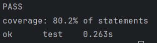

# Реализация онлайн библиотеки песен

## Переменные окружения
+ ```DATABASE_URL``` - URL к базе данных PostgreSQL
+ ```API_URL``` - URL к API, куда будет отправлять GET запрос по маршруту /info
+ ```SERVER_IP``` - IP сервера в ListenAndServe
+ ```PORT``` - порт сервера в ListenAndServe

## Модульные тесты
Тесты в [main_test.go](main_test.go).
Покрытие 80%.



## Документация
Документация в [docs.go](docs/docs.go), [swagger.json](docs/swagger.json) и [swagger.yaml](docs/swagger.yaml).

## Методы

+ getdata - получение данных библиотеки с фильтрацией по всем полям и пагинацией (пагинация с 1-индексацией, фильтрация по точному совпадению полей)
+ getsongtext - получение текста песни с пагинацией по куплетам (пагинация с 1-индексацией, куплеты разделяются по \n\n)
+ deletesong - удаление песни
+ editsong - изменение данных песни
+ addsong - добавление новой песни

## База данных
База данных PostgreSQL была поднята с docker-compose [docker-compose.yml](docker-compose.yml).