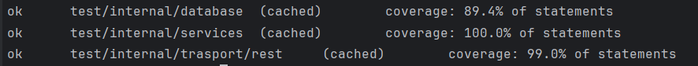

# Online song library

## Environment variables
+ ```DATABASE_URL``` - PostgreSQL URL
+ ```API_URL``` - API URL for GET request to /info route
+ ```SERVER_IP``` - ListenAndServe server IP
+ ```PORT``` - ListenAndServe server port

## Module test
Test are in [database_test.go](internal/database/database_test.go), [services_test.go](internal/services/services_test.go) and [handlers_test.go](internal/transport/rest/handlers_test.go).

80%+ coverage.



## Documentation
Documentation in [docs.go](docs/docs.go), [swagger.json](docs/swagger.json) and [swagger.yaml](docs/swagger.yaml).

## Routes

+ /getdata - get data with filtered by all fields and pagination (pagination with 1-indexing, filtering by exact match of fields)
+ /getsongtext - get the lyrics of the song with pagination by verses (pagination with 1-indexing, verses are divided by \n\n)
+ /deletesong - delete song
+ /editsong - edit song lyrics
+ /addsong - add new song

## Deployment
You can build server using a [Dockerfile](Dockerfile) and run server and PostgreSQL database using а docker-compose [docker-compose.yml](docker-compose.yml).